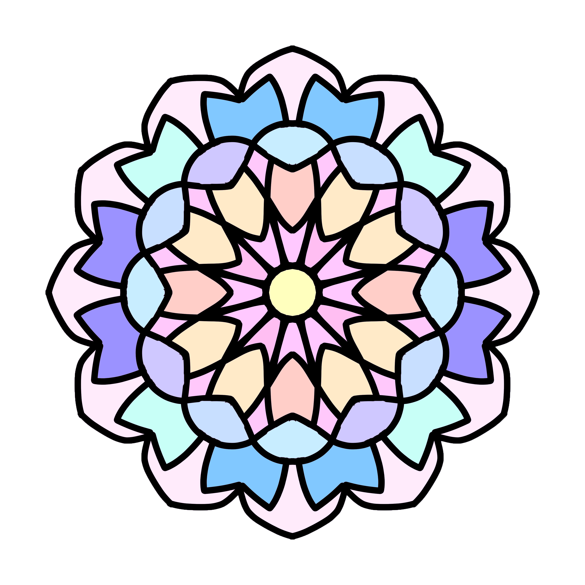
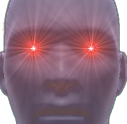

# 👋 Hi! 

I'm Emby01, you can call me Emby. I made this GitHub account originally just to connect it to Discord. But now I actually use it for programming-related and software development! Well kind of if you consider web development and occasional issue tracking "programming-related" stuff and "software develpoment". I'm still trying to figure out how to use GitHub to its fullest.

- ~~Proudly~~ part of [ErroneousCreations](https://github.com/ErroneousCreations), the definitely best indie game dev team
- i'm okay at HTML + CSS, ig. check out my current project, ErroneousJournalist, [here](https://github.com/Emby01/ErroneousJournalist)
- ugmania is really good go [download it](https://erroneouscreationist.itch.io/ugmania)

# 👀 What I do
I use this GitHub account for many things:

- Helping develop [ErroneousCreationist](https://github.com/ErroneousCreationist)'s game, Ugmania ([go check it out](https://erroneouscreationist.itch.io/ugmania)) 
- Also helping ErroneousCreationist create the [Wrian the Gamer mod for Don't Starve Together](https://steamcommunity.com/sharedfiles/filedetails/?id=2837791923)
- Something to connect to my Discord account (the more connections the cooler)
- Making some random HTML + CSS websites (like ErroneousJournalist)
- Game development (kind of)
- Figuring out how to use a pull request

# 🌱 What I’m currently learning
I'm overall just trying to get the hang of creating things with GitHub. Also trying to figure out how to get better at programming. And also trying to use Unity (and following Brackeys tutorials bc im dum).
# 💞️ I’m looking to collaborate on: 
Nothing. interesting choice of emoji for the template github. Collaboration is fun but that's something that I like to call a *later problem*. Keep that in mind.
# 📫 How to reach me ...
Find my Discord account it has the same pfp as my GitHub account. Not too difficult if you try!1 Don't give up!111
<!---
Emby01/Emby01 is a ✨ special ✨ repository because its `README.md` (this file) appears on your GitHub profile.
You can click the Preview link to take a look at your changes.
--->
